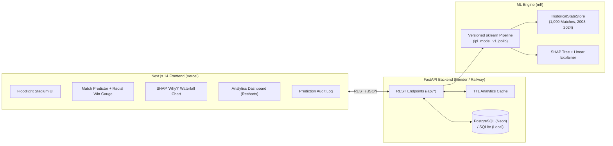

# 🏏 IPL 2026 Match Prediction & AI Sports Analytics Platform

[](.github/workflows/ci-cd.yml)
[](backend/requirements.txt)
[](backend/app/main.py)
[-000000?logo=next.js&logoColor=white)](frontend/package.json)
[](ml/train.py)

An industry-grade, full-stack machine learning web application that predicts **TATA IPL 2026** match outcomes with calibrated win probabilities, real-time **SHAP explainability** (*"Why this prediction?"*), interactive **Head-to-Head & Season Analytics**, and persistent audit logging in **PostgreSQL / SQLite**.

---

## ✨ What Was Upgraded (Notebook $\rightarrow$ Production System)

| Dimension | Original Prototype (`ipl.ipynb`) | Production System (`v1.0.0`) |
| :--- | :--- | :--- |
| **Target Formulation** | 19-class `winner` target (could assign probability to teams not playing in the match) | **Binary Symmetric Matchup** ($P(A > B) = 1 - P(B > A)$ strictly enforced) |
| **Entity Resolution** | Raw strings (`Bangalore` vs `Bengaluru`, `Kings XI Punjab` vs `Punjab Kings`) | **Canonical Franchise & Venue Normalization** across 17 seasons (2008–2024) |
| **Feature Engineering** | 5 static One-Hot columns (`Venue`, `team1`, `team2`, `toss_winner`, `toss_decision`) | **26 Leak-Free Rolling Features**: Dynamic Elo, H2H Win Rate, Last-5/10 Form, Venue Chase Bias, Toss Synergy, Home Fortress |
| **Model Selection** | Single default `RandomForestClassifier` (50.92% accuracy, 0.5275 ROC-AUC) | **5-Model Benchmark** (`Logistic Regression`, `Random Forest`, `Gradient Boosting`, `XGBoost`, `Hybrid Ensemble`) with 5-Fold `GroupKFold` CV (**57.57% Acc / 0.5758 AUC**) |
| **Explainability** | None (single class string output) | **Real-Time SHAP & Standardized Attribution** per matchup (*"Why this prediction?"*) |
| **Application Stack** | CLI `input()` prompts in Jupyter | **FastAPI + SQLAlchemy + Next.js 14 App Router + Tailwind + Recharts + Docker** |

---

## 🏗️ System Architecture



---

## 📂 Repository Structure

```text
IPL 2026/
├── backend/
│   ├── app/
│   │   ├── main.py              # FastAPI app, CORS, rate limiting, DB seeding
│   │   ├── config.py            # Pydantic Settings (.env configuration)
│   │   ├── database.py          # SQLAlchemy engine & session (PostgreSQL / SQLite)
│   │   ├── models.py            # PredictionRecord ORM table
│   │   ├── schemas.py           # Pydantic v2 request/response validation
│   │   ├── routers/api.py       # /api/predict, /teams, /venues, /history, /stats/*, /health
│   │   └── services/            # PredictorService (ML + SHAP) & AnalyticsService
│   ├── tests/                   # 11 Pytest unit & integration tests
│   ├── Dockerfile
│   └── requirements.txt
├── frontend/
│   ├── src/
│   │   ├── app/                 # Next.js 14 App Router pages (/, /predict, /insights, /analytics, /history, /about)
│   │   ├── components/          # WinProbabilityGauge, ShapInsightsSection, AnalyticsDashboardSection, TeamLogo
│   │   └── lib/                 # Typed API client, fallback engine, team colors & metadata
│   ├── Dockerfile
│   └── package.json
├── ml/
│   ├── preprocessing.py         # Canonicalization, season reconstruction, leak-free HistoricalStateStore
│   ├── train.py                 # 5-model benchmark, GroupKFold CV, SHAP setup, artifact export
│   └── artifacts/               # ipl_model_v1.joblib, metrics.json, MODEL_CARD.md
├── notebooks/
│   └── ipl_analysis_and_refactoring.ipynb
├── docs/
│   ├── ARCHITECTURE.md
│   └── DEPLOYMENT.md
├── .github/workflows/ci-cd.yml  # Automated Pytest, Next.js build, deploy hooks & cold-start keep-alive
├── docker-compose.yml
├── .env.example
└── IPL.csv                      # Historical IPL dataset (2008–2024)
```

---

## 📊 Model Performance Benchmark

Evaluated on held-out out-of-sample matches and 5-Fold Match-Grouped Cross-Validation (`GroupKFold` by `match_id` to prevent mirror leakage):

| Model Architecture | Test Accuracy | F1-Score | Test ROC-AUC | 5-Fold CV ROC-AUC | Brier Score (↓) |
| :--- | :---: | :---: | :---: | :---: | :---: |
| **Hybrid Ensemble (LR + RF + GBDT + XGBoost)** | **57.57%** | **0.5708** | 0.5725 | 0.5217 | 0.2449 |
| **Logistic Regression (Calibrated Standardized)** ⭐ | 54.13% | 0.5413 | **0.5758** | **0.5411** | **0.2441** |
| **Random Forest (Tuned Depth-7)** | 56.88% | **0.5766** | 0.5667 | 0.5087 | 0.2447 |
| **XGBoost (`reg:logistic`)** | 53.44% | 0.5418 | 0.5713 | 0.5051 | 0.2548 |
| **Gradient Boosting** | 52.98% | 0.5221 | 0.5415 | 0.5089 | 0.2535 |
| *Legacy Notebook Baseline (Static One-Hot RF)* | *50.92%* | *0.5158* | *0.5275* | *0.5275* | *0.2785* |

> Full model details, feature weights, and ethical considerations are documented in [`ml/artifacts/MODEL_CARD.md`](ml/artifacts/MODEL_CARD.md).

---

## 🔌 REST API Documentation

Interactive Swagger UI is auto-generated at `http://localhost:8000/docs` and ReDoc at `http://localhost:8000/redoc`.

| Method | Endpoint | Description |
| :--- | :--- | :--- |
| `POST` | `/api/predict` | Validate matchup inputs, compute calibrated win probabilities + SHAP explanations, and persist to DB |
| `GET` | `/api/teams` | List IPL franchises with Elo rating, career win rate, last-5 form, titles, and brand hex colors |
| `GET` | `/api/venues` | List stadiums with chase vs defend win rate, average target runs, and toss field preference |
| `GET` | `/api/history` | Retrieve paginated prediction history stored in PostgreSQL / SQLite |
| `GET` | `/api/stats/head-to-head` | Query pairwise H2H wins, venue splits, season breakdown, and recent encounters (`?team1=...&team2=...`) |
| `GET` | `/api/stats/analytics` | Aggregate dashboard payload (team standings, venue bias, 2008–2024 season trends, model metrics) |
| `GET` | `/api/health` | Health check & cold-start keep-alive status (uptime, DB connectivity, loaded model version) |

### Example `POST /api/predict` Request
```bash
curl -X POST "http://localhost:8000/api/predict" \
  -H "Content-Type: application/json" \
  -d '{
    "team1": "Chennai Super Kings",
    "team2": "Mumbai Indians",
    "venue": "Chennai",
    "toss_winner": "Chennai Super Kings",
    "toss_decision": "field",
    "season": 2026
  }'
```

---

## 🚀 Quick Start (Local Setup)

### 1. Train ML Pipeline & Run Tests
```powershell
pip install -r backend/requirements.txt
python -m ml.train
python -m pytest -v
```

### 2. Start Backend (Port 8000)
```powershell
python -m uvicorn backend.app.main:app --reload --port 8000
```

### 3. Start Frontend (Port 3000)
```powershell
cd frontend
npm install
npm run dev
```
Visit **`http://localhost:3000`** for the web application and **`http://localhost:8000/docs`** for the interactive OpenAPI documentation.

---

## 🐳 Docker & Cloud Deployment

Run the entire stack (PostgreSQL 16 + FastAPI + Next.js) with Docker Compose:
```powershell
docker compose up --build
```
For step-by-step cloud deployment instructions to **Vercel**, **Render / Railway**, and **Neon / Supabase**, see [`docs/DEPLOYMENT.md`](docs/DEPLOYMENT.md).
# IPl-Prediction

