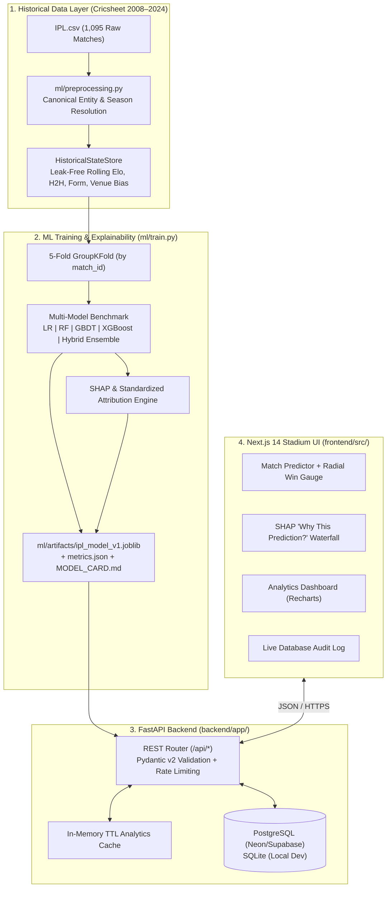

# System Architecture — IPL 2026 Match Prediction Platform

## 1. End-to-End Data & Inference Flow

## 2. Key Architectural Decisions

1. **Binary Symmetric Matchup Formulation**:
   - The original `ipl.ipynb` trained a 19-class classifier directly on the `winner` column, allowing non-playing teams to receive probability mass.
   - We reformulated the problem to binary classification ($y = 1$ if `winner == team1` else $0$), augmented every training match with its mirrored perspective `(team2 vs team1)`, and average forward and reverse probabilities at inference time so $P(A > B) = 1 - P(B > A)$ holds to machine precision.
2. **Zero-Leakage Sequential Feature Store (`HistoricalStateStore`)**:
   - Features for match $i$ are computed strictly before updating the state store with match $i$'s outcome.
   - At inference time for IPL 2026, the persisted `HistoricalStateStore` reflects all 1,090 completed matches up to the end of the dataset.
3. **Cold-Start Resilience**:
   - Free-tier cloud hosts (Render/Railway) spin down idle containers after 15 minutes.
   - We mitigate this at three levels:
     1. A scheduled GitHub Actions cron job pings `GET /api/health` every 14 minutes.
     2. The Next.js frontend issues an immediate warm-up health check on mount.
     3. If the backend is still waking up, the frontend's deterministic Elo/Venue client fallback engine (`buildClientFallbackPrediction`) provides zero-latency predictions until the container is online.
